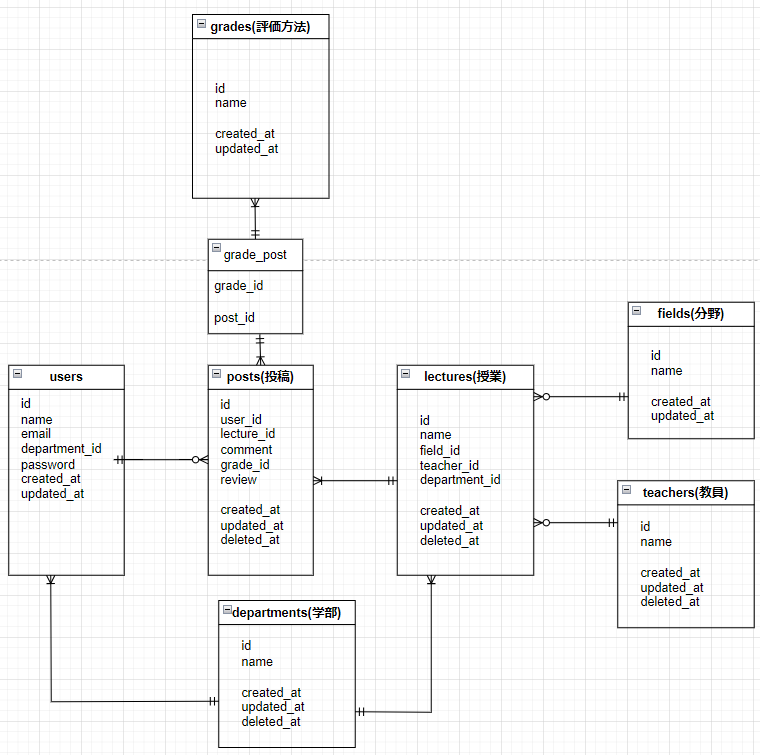
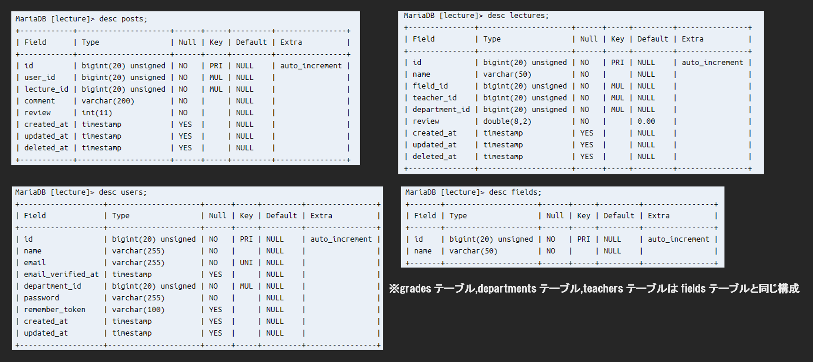

<h1 align="center">早稲田講義レビュー</h1>

## 制作背景

大学入学前いきなり与えられた履修登録という試練.どんな授業を取るとよいか,何限に取るのがおすすめかについてはSNS上で知ることができたがシラバスを見てもどの講義が面白いのかよくわからない.実は大学3年生になってもわからないままだったのです.友人から聞くように他の人が講義を受けて思ったことを共有できたらなと思って制作しました.

<b>講義を取ってよかった</b>と思える人が増えればいいなと思います.

## 概要
「数学の課題がメインの講義ないかなー」なんてなんとなく分野は決まってるけどその講義の進め方がどうなってるかわからないという人へ
早稲田講義レビューでは
<a href="https://lecturereview-8806b1ca4f86.herokuapp.com/" target="_blank">アプリへGO</a>
## Laravel Sponsors
<b>使用言語：</b>
- PHP8
- Laravel9
- HTML
- CSS
- Tailwind
  
<b>開発環境：</b>
- Cloud9
- MariaDB
- GitHub
- Git

<b>デプロイ：</b>
- Heroku

## データ構成
<b>テーブル構成・リレーション</b>
 

 
<b>各テーブル詳細</b>
 

## こだわり
<video src="public/video/レビュー投稿 - Made with Clipchamp.mp4"/></video>
<video src="public/video/レビュー検索 - Made with Clipchamp.mp4"/></video>
<video src="public/video/授業作成 - Made with Clipchamp.mp4"></video>

### Premium Partners

- **[Vehikl](https://vehikl.com/)**
- **[Tighten Co.](https://tighten.co)**
- **[Kirschbaum Development Group](https://kirschbaumdevelopment.com)**
- **[64 Robots](https://64robots.com)**
- **[Cubet Techno Labs](https://cubettech.com)**
- **[Cyber-Duck](https://cyber-duck.co.uk)**
- **[Many](https://www.many.co.uk)**
- **[Webdock, Fast VPS Hosting](https://www.webdock.io/en)**
- **[DevSquad](https://devsquad.com)**
- **[Curotec](https://www.curotec.com/services/technologies/laravel/)**
- **[OP.GG](https://op.gg)**
- **[WebReinvent](https://webreinvent.com/?utm_source=laravel&utm_medium=github&utm_campaign=patreon-sponsors)**
- **[Lendio](https://lendio.com)**

## Contributing

Thank you for considering contributing to the Laravel framework! The contribution guide can be found in the [Laravel documentation](https://laravel.com/docs/contributions).

## Code of Conduct

In order to ensure that the Laravel community is welcoming to all, please review and abide by the [Code of Conduct](https://laravel.com/docs/contributions#code-of-conduct).

## License

The Laravel framework is open-sourced software licensed under the [MIT license](https://opensource.org/licenses/MIT).
